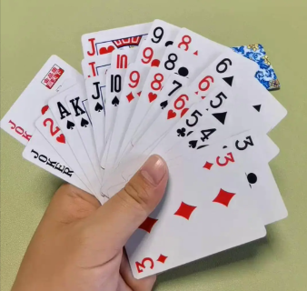

# 2.选择排序算法

和生活中打扑克一样，下方是模拟一个打扑克新手排列牌的情况：



拿到手后，从前往后找，找出最大的，抽出来，放到最前面第一位，然后再在剩下 的牌堆中去找他里面最大的，再抽出来排到最前面第二位，直到卡片排完，就排列完了。

在移动的途中，我们就可以发现每次我们去抽牌放到牌头位子时，左边的有顺序的扑克就会越来越多，右侧无序的就越来越少；
等到都变有序的，我们就排列完了。

非常简单，你需要在脑子里中有个印象，你修改何处，能实现将原来的"从小变大"变成"从大变小"就说明掌握了。

##  python写法
```python
def selection_sort(arr):
    n = len(arr)
    for i in range(n - 1):
        # 假设当前位置的元素为最小值
        min_index = i
        for j in range(i + 1, n):
            # 在剩余部分中寻找最小值的索引
            if arr[j] < arr[min_index]:
                min_index = j
                # 将当前位置的元素与最小值进行交换
        if min_index != i:
            arr[i], arr[min_index] = arr[min_index], arr[i]


# 测试代码
numbers = [4, 2, 6, 1, 3]
selection_sort(numbers)
print(numbers)  
# 输出：[1, 2, 3, 4, 6]
```

## C++写法
```C++
//1.选择排序算法
#include<iostream>
using namespace std;
int a[1000];
int main(){
	int n,min,index;
	cin>>n;
	for(int i=0;i<n;i++){ //1.输入值到数组 
		cin>>a[i];
	}
	for(int i=0;i<n;i++){ 
		min = a[i]; // 假设第一个为最小值 
		index = i; // 锁定最小值索引 
		for(int j=i+1;j<n;j++){ //逐个跟后面比对
			if(min>a[j]){ // 大于最小值，则更新值 
				min = a[j]; //更新值 
				index = j;  //更新索引 
			}
		}
		if(i!=index){ // 当索引不一致，代表最小值变了 
			swap(a[i],a[index]); //那就交换第一个值与最小值的位置。 
		} 
	}
	for(int i=0;i<n;i++){ //输出结果。 
		cout<<a[i]<<" ";
	}
	
	return 0;
} 
```
## 复杂度分析

- 最坏情况O(n²)   --> 即使数组已经完全有序，选择排序仍然会完整执行所有比较来找到每个位置上的最小元素，不会提前终止。
- 最好情况O(n²)    --> 无论初始顺序如何，算法执行的比较次数是固定的。
- 平均情况O(n²)
- 空间复杂度 O(1) -->原地排序